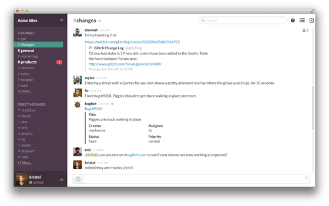

## 编码题

良好的编码能力是对工程师的基本要求，也是我们招聘时的重要参考，请在以下几道题中挑选任意一道来回答。

基本要求：

* 后端可以使用任意自己喜欢的语言，比如 PHP、Python、Java 或 Node。
* 请记录下你在解决这个问题过程中的思考，你是如何一步步解决的，以及遇到哪些技术问题和感想等。
* 将源码放在 github 上。

建议：使用各种你认为最优秀的技术（工具、框架、库等），展现你的知识面。
 
### 题目一：在线网盘

实现通过 Web 管理本地文件夹的功能，需求如下：

* 配置将某个本地文件夹作为主目录。
* 前端展现可以类似百度网盘（或者 Windows 资源管理器及 Mac Finder 等），可以修改文件名、创建文件夹、上传文件、删除文件等。
* 更多功能可以自由发挥，包括展现方面可以自己设计。
* 可以思考一下如何更好的管理文件？是否有更好的信息展现方式？

### 题目二：在线聊天室

实现类似 [slack](https://slack.com/) 的实时在线聊天室，它可以：

* 创建一个 room，任意人加进去聊天
* 可以发消息和删除消息

其实这个应用可以做很多扩展，具体改做什么功能你来决定，比如：

* 支持多种消息类型，比如 Markdown、表情
* 上传文件、贴图等
* 桌面提示
* URL 预览
* @ 功能

slack 的截图如下，不过不要求完全照抄界面。

